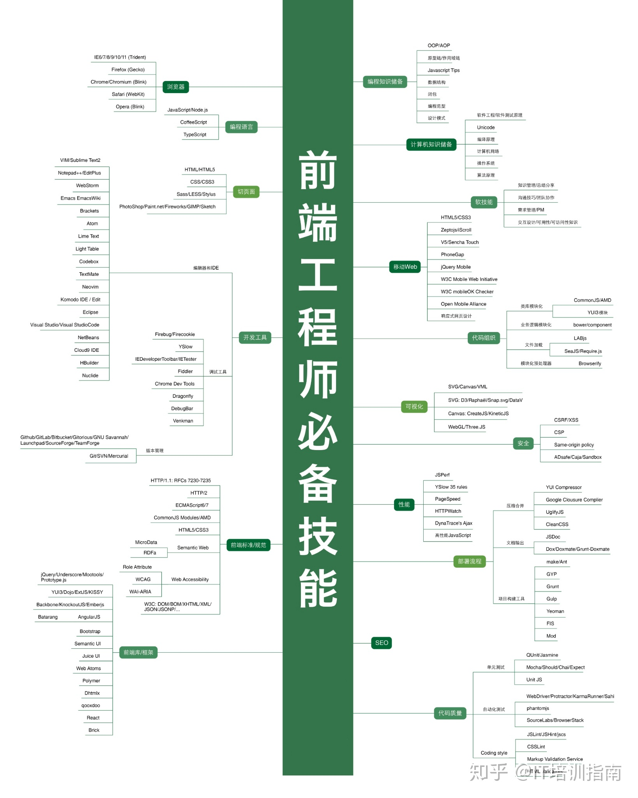

# 自我介绍

## 个人简介
Hello~大家好，我是Derek，年方二十有八。步入职场已四载有余，接触了几个职业也是形状各异，动静结合，老少皆宜。。编不下去了。

## 爱好
* 学习 干就完了
* 篮球 好久不打
* 音乐 偶尔听听
* 健身 荒废数日
* 游戏 从没停过 -_-#
  
## 其他
1. 自学了一阵`html` `css` `js`
   随便写一句
```JavaScript
function task8(a) {
    console.log(a);
}

task8("Hello World~");
```

2. 前端要学这么多东西啊
   

3. 目前在学习过程中，遇事不决，[度娘](https://www.baidu.com)解决。

4. 方方老师说的好：
   > 学完这节课全部忘掉

5. 就写到这吧，辛苦大佬批复，感谢感谢！